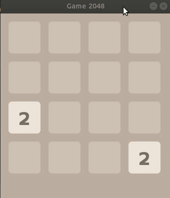

# Showcase

## Game 2048

## Game Of 15

___

# Task Description

###### The goal of this assignment is to implement two games: ***Game 2048*** and ***Game of Fifteen***.

The games are partly implemented already, so your task is to finish the implementation by following the step by step guide and doing small tasks on the way. You need to reuse your implementation of the GameBoard interface from the previous task.

After finishing the game you can play it yourself by running main function in ui/PlayGame2048 or ui/PlayGame2048.

## Game 2048

If you're unfamiliar with Game 2048, you can first spend some time playing it online. Just don't forget about the assignment itself!

Initially, you see two numbers on the board (each one might be 2 or 4). The numbers can be moved to any of the four directions: up, down, right or left. On each move, the neighboring numbers of the same value are merged producing a new doubled number. After the move, a new element of the value 2 or 4 is added to a random free cell. Note that only the numbers which are equal to the power of 2 can be present on the board. If the board is full, the game is over. The goal is to get 2048.

Implement the functionality that moves the content in one row or column: removes empty cells and merges identical elements. To get you familiar with lambdas and generics, this functionality is declared as a generic function that accepts as argument, a method to merge two equal elements.
Source: Game2048Helper.kt; tests: TestGame2048Helper.kt.

Specify how the new element should be added. By the rules of the game 2048, the new cell with the value 2 or 4 (the latter in 10% of the cases) is added to a random empty cell.
Source: Game2048Initializer.kt; tests: TestGame2048Initializer.kt.

You can find the main game process in the Game2048 class. Implement the utility function addNewValue that adds a new value to a random free cell. The initializer parameter returns both a value and a cell that the new value should be added to.
Source: Game2048.kt; tests: TestAddingValue.kt.

Implement the utility function moveValuesInRowOrColumn, which updates the map contents by moving the elements only in one row or column.
Source: Game2048.kt; tests: TestMoveValuesInRowOrColumn.kt.

Implement the remaining function moveValues, which moves all the elements in a board to a given direction following the rule games.
Source: Game2048.kt; tests: TestMoveValues.kt.

## Game of Fifteen

The board for the game of Fifteen is filled randomly with numbers from 1 to 15 and one empty space. You can move the neighboring value to the empty space. The goal is to get the sorted sequence from 1 to 15.

You can check the Game of Fifteen online here. Note that in the implementation for this assignment, the values are moved by arrows rather than mouse clicks.

Game of Fifteen is solvable only if the initial permutation of numbers is even. First, implement the function isEven declared in GameOfFifteenHelper.kt checking whether a permutation is even or odd. Source: GameOfFifteenHelper.kt; tests: TestGameOfFifteenHelper.kt.
You can use the following algorithm to check the given permutation. Let P is a permutation function on a range of numbers 1..n. For a pair (i, j) of elements such that i < j , if P(i) > P(j), then the permutation is said to invert the order of (i, j). The number of such inverted pairs is the parity of the permutation. If permutation inverts even number of such pairs, it is an even permutation; else it is an odd permutation.

Use the isEven function to produce only solvable permutations as initial permutations. Source: GameOfFifteenInitializer.kt; tests: TestGameOfFifteenInitializer.kt.

Implement the GameOfFifteen class from scratch describing the game process. It should implement the Game interface and make use of initializer argument. Note that this argument is used in tests to provide a different initial permutation. Source: GameOfFifteen.kt; tests: TestGameOfFifteen.kt.

